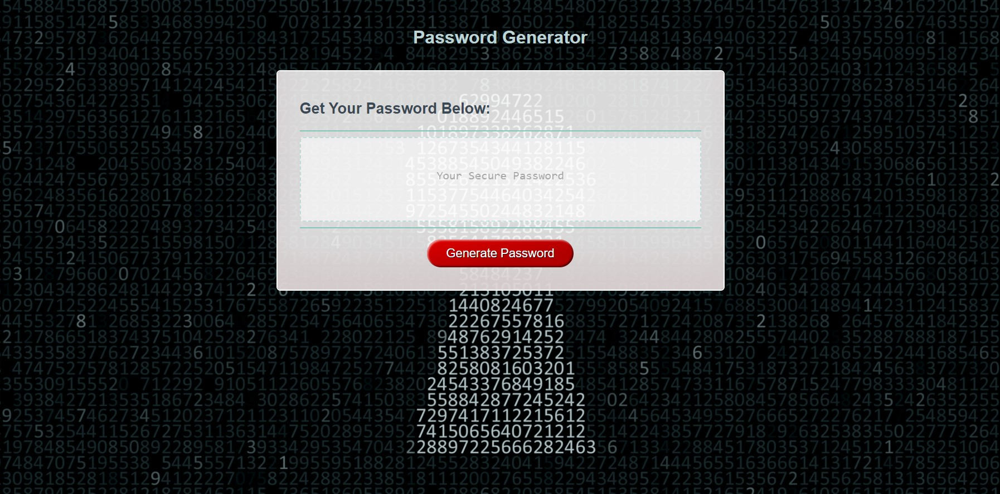

# Password-Generator
_An app to generate strong secure passwords._

## Overview
I have been asked by my client to create an application that an employee can use to generate a random password based on criteria they select from the prompts they receive This app should run in any browser, and should feature dynamically updated HTML and CSS powered by JavaScript code to randomly generate the password. 

## Description
The “Password Generator” App should be able to run on all browsers. It is important that the user interface is clean, polished and responsive, ensuring that it adapts to multiple screen sizes and provides a pleasurable user experience. 

## Usage
This Repo is made up of the core files and folders related to the task. I have added comments to all the relevant sections of the code, highlighting key areas and the expected result derived from it. The content comprise only that related to the task and I have kept the interface very simple and straight forward to use. Simply click on the button to start, follow the prompts, and refresh the page to start over; it’s that easy. Click [**here.**](https://rodev-apps.github.io/Password-Generator/)
 to begin.

 ## Mock-up

## Website
Click [**here.**](https://rodev-apps.github.io/Password-Generator/) to visit site.

## Feedback
Please feel free to reach out or drop a comment here if you have any questions, queries or suggestions. Otherwise, you can find me on the Slack platform Pod 5, just search for Rod.

_Rodevs-Ch-Wk5_     
